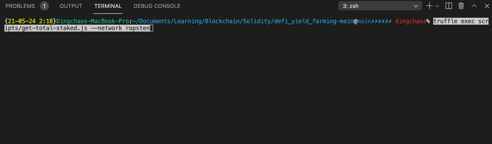
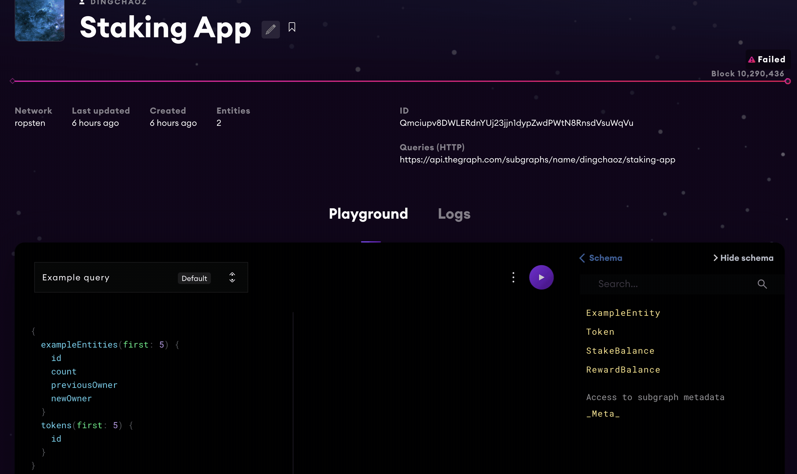

# ECR20 Yield Farming
This project focuses on developing a smart contract which implements the concept of yield farming pool on any ECR20 token.

The pool provides a service where people can deposit ECR20 token and they will receive weekly rewards. Users is able to take out their deposits along with their portion of rewards at any time. New rewards are deposited into the pool by the Pool owner each week.

Oppenzeppline is used to provide a suite of security templates to build, manage, and inspect aspects of this project development.

---
This repository presents following deliverables:
- 2 smart contracts:
  - 1. [MethToken.sol](.src/contracts/MEthToken.sol): an ECR20 smart contract allow users to define their own token to be staked and rewarded to a pool, deployed on Ropsten Testnet at this [address](https://ropsten.etherscan.io/address/0x172A7156ede95D49eFcFc5A7cb2e28123F4b1c97)
  - 2. [TokenFarm.sol](.src/contracts/TokenFarm.sol): a smart contract implements the concept of building a yield farm pool of an ECR20 token, deployed on Ropsten Testnet at this [address](https://ropsten.etherscan.io/address/0xaCcA74DD488147eC29D4a9CbA62917d78d4bb798)

  

- Unit and Integration tests: [TokenFarm.test.js](.test/TokenFarm.test.js), and [utils.js](.utils/utils.js) to test the development and deployment of the smart contracts

  
- A client-side javascript: [get-total-staked.js](.scripts/get-total-staked.js) to allow user interact with the smart contract to get total staked value.

  
- A subgraph on Graph protocol to query staked values, reward values and stakers, viewable on the [Graph dashboard](https://api.thegraph.com/subgraphs/name/dingchaoz/staking-app)

  

---

## Installation

### Setup

- **Node.js**

      sudo curl -o- https://raw.githubusercontent.com/nvm-sh/nvm/v0.37.2/install.sh | bash
      nvm install 12.18.3
      node -v

- **Truffle**

      sudo npm install -g truffle@5.1.39 --unsafe-perm=true

- **Ganache** installation guide can be found in [here](https://www.trufflesuite.com/ganache).

- **MetaMask** installation guide can be found in [here](https://metamask.io/).

### Commands

- Install necessarily Node.js packages

      npm install

- Deploy smart contracts to the Ethereum blockchain locally

      truffle migrate --reset
          
- Run the scripts to issue tokens and query total staked tokens locally on a simulation network such as Ganache-cli

      truffle exec scripts/issue-tokens.js
      truffle exec scripts/get-total-staked.js

- Deploy smart contracts to Ropsten Testnet

      truffle migrate --network ropsten

- Run the scripts to issue tokens and query total staked tokens from the public Ropsten testnet

      truffle exec scripts/issue-tokens.js --network ropsten
      truffle exec scripts/get-total-staked.js --network ropsten

## Design and Development practices
### Security 
- The access control of your contract may govern who can mint tokens, vote on proposals, freeze transfers, and many other things, [Ownable](https://github.com/OpenZeppelin/openzeppelin-contracts/blob/master/contracts/access/Ownable.sol) from openzeppline is used for implementing ownership in our contracts
- Prevent reentrancy attack: ReentrancyGuard, [which](https://docs.openzeppelin.com/contracts/2.x/api/utils#ReentrancyGuard-nonReentrant--) is applied to several functions to make sure there are no nested (reentrant) calls to them, also Checks-effects-interactions pattern is used to ensure only after all state changes are resolved should the function interact with other contracts
- [SafeMath](https://docs.openzeppelin.com/contracts/4.x/utilities#api:math.adoc#SafeMath) is used to check for overflows in case of addition, underflow in case of substractions as well as when performing multiplications and divisions.

### Modularity and Reusablity
- Rewardrate is impacted each time a new deposit is added or withdrawn from the pool, to make such operation
reusable, an updateReward modifier was created to modify the behaviours.
 of stakeTokens, withdraw ,getReward and notifyNewReward 

### Tests

### Rewards Distribution Manual vs Auto

## Citation
If you use this code for your publications, please cite it as:

    @ONLINE{vdtct,
        author = "Dingchao Zhang",
        title  = "Yield Farming App",
        year   = "2021",
    }

## Author
Dingchao Zhang

## License
This system is available under the MIT license. See the LICENSE file for more info.

